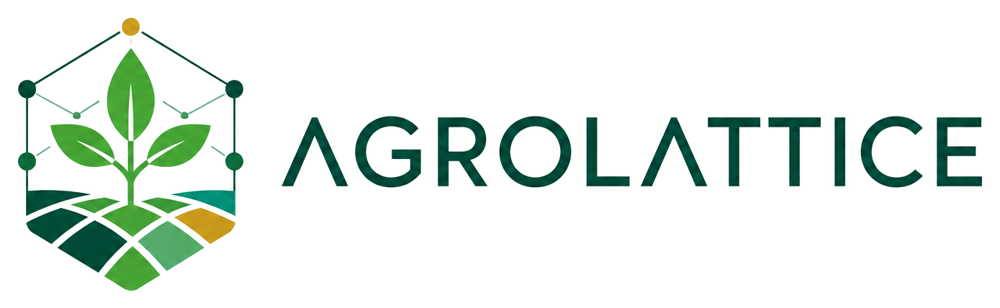
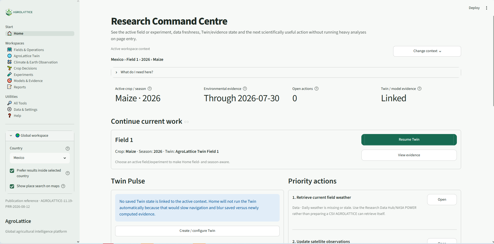
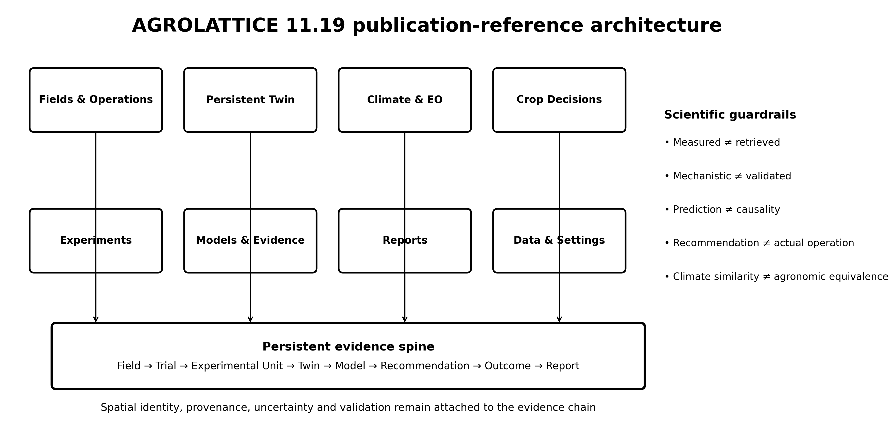
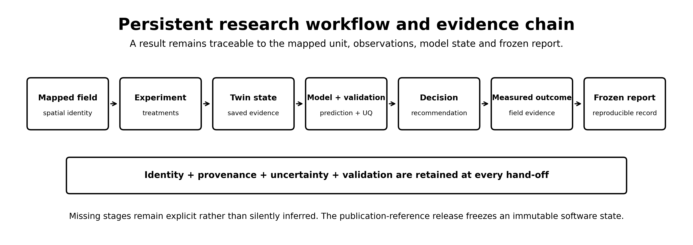
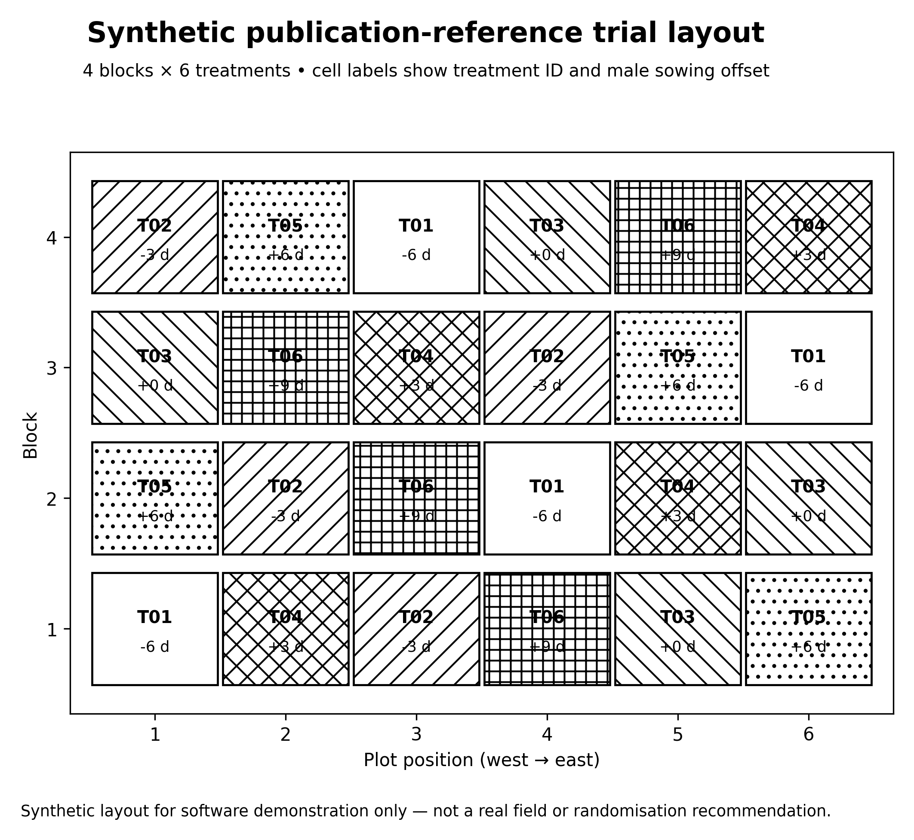
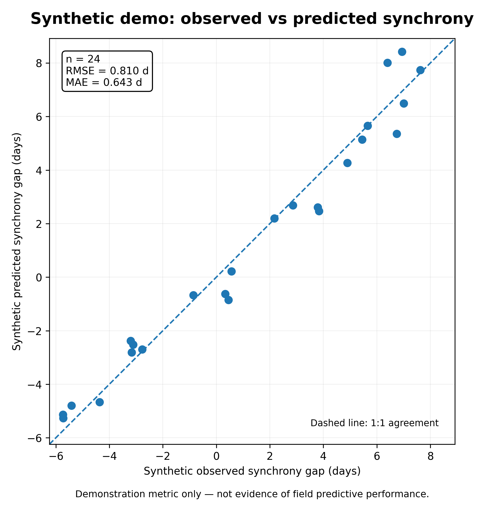

<p align="center">
  
</p>

<h1 align="center">AGROLATTICE</h1>

<p align="center">
  <strong>A persistent, spatially explicit agricultural digital-twin platform for integrated genotype × environment × management research and decision support.</strong>
</p>

<p align="center">
  
  
  
  
</p>

---

## Overview

AGROLATTICE is research software for building **persistent agricultural digital twins** that connect mapped fields, environmental conditions, crop physiology, management, experiments, remote sensing, observations, models, validation, and outcomes.

The platform is designed around the scientific problem of learning and testing **genotype × environment × management (G×E×M)** relationships across fields, seasons, and locations. Its core design principle is integration rather than isolated analysis: GIS, long-lived field/season twins, crop models, experimental design, climate and Earth observation, prediction, validation, uncertainty, and research reporting are linked within one research environment.

The current frozen software reference is **AGROLATTICE 11.19** with publication reference identifier:

```text
AGROLATTICE-11.19-PRR-2026-08-12
```

This repository also contains the retained **AC3 adaptive climate-clustering build** and the **SB1 spatially balanced climate-clustering build** used to extend the 11.19 analysis interface without changing the displayed release identity.


> **Portfolio-source notice:** This repository is source-visible for professional and
> research-software evaluation. AGROLATTICE is not released as open-source software.
> Commercial use, redistribution, modification, derivative products, and production
> deployment require prior written permission. See [`LICENSE`](LICENSE).

> **Research-software status:** AGROLATTICE outputs are decision-support and research outputs, not guarantees of agronomic performance. Model predictions, climate similarity, cluster membership, crop-model simulations, and recommendations require appropriate local validation.

---


## AGROLATTICE in action

<p align="center">
  
</p>

<p align="center">
  <em>
    AGROLATTICE 11.19 Research Command Centre: a field- and season-aware entry point linking mapped research context,
    environmental evidence, persistent Twin state, model evidence and scientifically useful next actions.
  </em>
</p>

---

## Platform architecture

<p align="center">
  
</p>

AGROLATTICE uses a spatial hierarchy of:

**Country → research centre/farm → field → trial → experimental unit → plant/observation**

Field geometry is authoritative. Trials and experimental units are linked to mapped fields so spatial layout, treatments, observations, remote-sensing outputs, and persistent Twins can refer to the same real-world units.

---

## Core workspaces

| Workspace | Purpose |
|---|---|
| **Home** | Research command centre, project context, readiness, and navigation. |
| **Fields & Operations** | Farms, mapped fields, geometry, scouting, tasks, sensors, irrigation, nutrition, management zones, and field operations. |
| **AgroLattice Twin** | Persistent field/season digital twins, root-zone state, crop development, observations, scenarios, calibration, and longitudinal evidence. |
| **Climate & Earth Observation** | Climate similarity, climate-zone discovery, site transferability, trends, anomalies, hazards, drought, satellite monitoring, and spatial analysis. |
| **Crop Decisions** | Phenology, crop suitability, yield screening, soil-water balance, water productivity, crop planning, AquaCrop, DSSAT/APSIM interoperability, and decision support. |
| **Experiments** | Trial design, spatial experimental units, G×E×M datasets, maize flowering trials, and synchrony research. |
| **Models & Evidence** | Validation, research-model registry, multimodal fusion, hybrid mechanistic+ML modelling, benchmarks, ensembles, and evidence tracking. |
| **Reports** | Persistent research reporting, provenance, tables, figures, and publication-oriented outputs. |
| **All Tools** | Access to the complete tool catalogue, including retained legacy utilities. |
| **Data & Settings** | Country data, dataset updating, projects, configuration, diagnostics, and platform controls. |
| **Help** | Onboarding, scientific guidance, glossary, publication-reference material, and reproducibility resources. |

---

## Scientific capabilities

### Persistent agricultural Twins

A Twin is a long-lived representation of a real field and season rather than a one-off model run. The intended evidence chain is:

```text
environment → soil/root zone → crop development → phenology/stress
→ management → satellite/sensors → treatments → phenotype
→ yield/quality/reproductive outcome
```

Twins support state, timelines, observations, scenarios, calibration, uncertainty, experiment links, recommendations, and cross-season learning. The preferred modelling direction is **mechanistic crop modelling + observations + remote sensing + statistical/ML residual correction + uncertainty**, rather than replacing useful crop biology with an opaque predictor.


### Persistent research workflow

<p align="center">
  
</p>

The workflow deliberately keeps missing stages explicit. A model output is not silently relabelled as a measurement, a recommendation is not treated as an actual operation, and provenance remains attached as evidence moves from mapped field to frozen report.

### Climate and agroclimatic analysis

AGROLATTICE preserves the established **19-variable NASA-derived agroclimate representation** used by the platform and supports country-aware climate workflows rather than hard-coding one country into global functions.

Release 11.19 includes climate-zone workflows ranging from focused K-means to the AC3 multi-method framework. AC3 can compare K-means, bisecting K-means, Gaussian mixtures, BIRCH, Ward hierarchical clustering, and average-cosine hierarchical clustering using common held-out evaluation, independent audit, stability checks, cluster-size safeguards, and assignment-confidence reporting. HDBSCAN is retained as a density/noise diagnostic rather than an inductive championship candidate.

The SB1 build adds **spatially balanced sampling** for climate clustering. The default uses equal-area support cells with a **50 km** nominal width, adjustable from **25–100 km**. Climate profiles are aggregated within occupied cells so densely sampled regions do not receive disproportionate influence, while final cluster labels are assigned back to all eligible catalogue locations for mapping and export.

Climate clusters are empirical structures in the selected climate feature space. They are **not official agroecological zones**, do not prove transferability, and do not establish causal agronomic equivalence.

### Mechanistic Maize Twin

The mechanistic maize component implements an independent approximation based on concepts reported by Laurent et al. (2025), *Crop Science* 65, DOI `10.1002/csc2.21453`.

Implemented assumptions include planting-to-emergence thermal time, post-emergence leaf-number development, ear-growth onset, ear biomass initiation, genotype-specific female silking, and male anthesis timing. Genotype parameters include `tln`, `coblf`, and `ebR1`, with publication-derived priors available as priors rather than local measurements.

The proprietary source data and original C++ Bayesian sampler from the publication are not available in this repository. AGROLATTICE therefore does **not** claim exact reproduction of the published implementation. Local flowering observations and leaf counts should be used for calibration, and timing predictions do not guarantee pollen quantity or seed purity.

### Maize Synchrony Lab

The maize synchrony workflow is designed for hybrid-maize seed-production research. Synchrony is not represented only as a fixed sowing offset. Experimental factors can include male and female genotype, sowing density, sowing date, male/female sowing dates, sowing-date difference, block/replication, irrigation or management treatment, and spatial experimental-unit assignment.

Relevant outcomes include anthesis, silking, flowering synchrony, plant and ear traits, tagged-plant leaf counts, seed purity, and harvest outcomes.

### Crop, water, EO, and model integration

The platform includes support for daily weather and phenology, soil-water balance, irrigation records and recommendation modes, satellite crop monitoring, crop suitability, water productivity, AquaCrop-OSPy integration, and DSSAT/APSIM interoperability. External model runs retain configuration and provenance and should surface failures rather than silently substituting outputs.

---

## Release 11.19 publication reference

AGROLATTICE 11.19 freezes the integrated 11.x platform for the associated platform manuscript. It provides:

- stable publication reference ID `AGROLATTICE-11.19-PRR-2026-08-12`;
- deterministic synthetic demonstration data using seed `1119`;
- 24 synthetic experimental units, 4 blocks, and 6 treatments;
- all 19 canonical environmental-variable columns in the demonstration workflow;
- reproducible publication figures in PNG and SVG;
- example output tables and manuscript-safe demonstration results;
- `CITATION.cff`, `codemeta.json`, and `.zenodo.json` metadata;
- a restrictive proprietary portfolio-evaluation license for original AGROLATTICE source code;
- source and release manifests plus verification utilities;
- schema-only exports for protected local databases;
- a publication-safe archive builder that excludes local databases, installed datasets, caches, attachments, and run artifacts.

The deterministic demo is for **software reproducibility**, not empirical validation. It must not be described as field, NASA POWER, Sentinel, sensor, or agronomic validation data.

---


### Synthetic publication-reference figures

<table>
  <tr>
    <td align="center" width="50%">
      <br>
      <strong>Synthetic trial layout</strong><br>
      <sub>4 blocks × 6 treatments; demonstration only.</sub>
    </td>
    <td align="center" width="50%">
      <br>
      <strong>Observed vs predicted demo</strong><br>
      <sub>Deterministic software-reproduction metric; not field validation.</sub>
    </td>
  </tr>
</table>

---

## Installation

### Recommended: Windows + Anaconda

AGROLATTICE is primarily developed for a local **Windows + Python/Anaconda + Streamlit** workflow.

Clone the repository:

```bash
git clone https://github.com/apavlo89/AGROLATTICE.git
cd AGROLATTICE
```

Activate the Python/Conda environment you want to use, then run:

```text
INSTALL_DEPENDENCIES.bat
```

Start AGROLATTICE with:

```text
RUN_APP.bat
```

`RUN_APP.bat` performs a release-specific preflight before launching Streamlit and is the preferred Windows entry point.

### Manual Python installation

For environments where the Windows helpers are not used:

```bash
python -m pip install -r requirements_ml_agriculture.txt
python -m streamlit run agrolattice.py
```

The frozen publication-reference package list is available in:

```text
requirements_publication_reference_lock.txt
```

Optional integrations have separate installers/requirement files, including research-model packages, satellite dependencies, and AquaCrop-OSPy. DSSAT and APSIM require their own external installations and licensing/usage conditions where applicable.

---

## Public repository and data boundary

This GitHub repository is intended to contain **publication-safe source code and reproducibility assets**, not a researcher's complete working installation.

The public-source policy excludes local materials such as:

- SQLite research databases and their WAL/SHM files;
- installed country climate datasets and `worldcities.csv`;
- field-operation attachments;
- project and study stores;
- caches and dataset-update workspaces;
- satellite exports;
- external-model run artifacts;
- local analysis history and user-specific settings.

See [`PUBLIC_ARCHIVE_EXCLUSIONS.md`](PUBLIC_ARCHIVE_EXCLUSIONS.md) and [`build_public_archive.py`](build_public_archive.py) for the archive policy.

The repository's [`.gitignore`](.gitignore) provides a second line of defence for local development, but **`.gitignore` does not remove files that were already committed**. Previously tracked user-specific files must be explicitly removed from Git history/tracking if they were committed before the ignore rules were added.

Full data-dependent workflows require suitable datasets to be configured through AGROLATTICE. Upstream data-provider terms and provenance remain applicable.

---

## Reproduce the bundled demonstration

The publication-reference demonstration is deterministic and does not require private research data.

On Windows:

```text
RUN_PUBLICATION_REFERENCE_DEMO.bat
```

Or directly with Python:

```bash
python publication_reference.py --output publication_reference
```

Reference assets are located under [`publication_reference/`](publication_reference/), including:

- `demo_project/` — synthetic demonstration inputs;
- `figures/` — reproducible architecture/workflow/demo figures;
- `example_outputs/` — reference tables and summaries;
- `database_schemas/` — schema-only SQL exports;
- `environment/` — instructions for freezing the manuscript runtime.

---

## Verification

Release-specific verification scripts are included in the repository. For the current 11.19 reference and retained clustering builds:

```bash
python verify_release11_19.py
python verify_release11_19_ac3.py
python verify_release11_19_spatial_balance.py
```

The repository also includes release manifests, build identifiers, SHA-256 manifests, and verification reports. Verification demonstrates software/package integrity against the declared release checks; it is **not agronomic validation**.

---

## Scientific integrity and interpretation

AGROLATTICE distinguishes, where feasible, among:

- measured observations;
- derived variables;
- assumptions and priors;
- model outputs;
- forecasts;
- recommendations.

Users should preserve provenance, report uncertainty where feasible, and avoid causal claims from observational associations. Validation should be grouped by appropriate research units such as site, field, season, genotype, or experimental block when random splitting would create leakage or overstate generalisation.

Mechanistic does not mean automatically correct. Climate similarity does not prove agronomic equivalence. A statistically stable cluster does not by itself define a biologically meaningful production zone. Recommendations should be field-validated before operational use.

---

## Repository structure

Key files and folders include:

```text
AGROLATTICE/
├── agrolattice.py                     # Main Streamlit application
├── RUN_APP.bat                        # Preferred Windows launcher/preflight
├── INSTALL_DEPENDENCIES.bat           # Core dependency installer
├── requirements_ml_agriculture.txt    # Core application dependencies
├── docs/images/                       # README/public documentation images
├── publication_reference/             # Deterministic reproducibility bundle
├── assets/brand/                      # AGROLATTICE branding assets
├── components/                        # Custom UI components
├── *_command_centre.py                # Workspace-specific modules
├── agrolattice_twin.py                # Persistent Twin database/model layer
├── maize_mechanistic_twin.py          # Mechanistic maize implementation
├── maize_pollination_lab.py           # Maize synchrony/flowering workflows
├── agroclimatic_selection_ac3.py      # Multi-method climate clustering
├── build_public_archive.py            # Publication-safe source builder
├── CITATION.cff                       # Machine-readable citation metadata
├── codemeta.json                      # Software metadata
├── .zenodo.json                       # Archive/deposition metadata
├── THIRD_PARTY_NOTICE.md              # Third-party/data/method boundary
└── LICENSE                            # Restrictive portfolio-evaluation license
```

---

## Citation

If you use AGROLATTICE in research, cite the archived **AGROLATTICE 11.19 Publication Reference Release** and the associated platform paper when available.

GitHub can read [`CITATION.cff`](CITATION.cff) directly and expose a **Cite this repository** option.

Current software metadata:

```text
Pavlou, A., Garcia-Vite, T. K., & Garcia De los Santos, G. (2026). AGROLATTICE: Publication Reference Release (Version 11.19). Software.
Publication reference: AGROLATTICE-11.19-PRR-2026-08-12
```

If a DOI is required for a manuscript, choose an archival route and access setting that is compatible with the project's proprietary licensing and commercialization plans. Do not publicly archive the full source merely to obtain a DOI without first deciding what rights and access should persist.

---

## License and third-party material

AGROLATTICE is **proprietary source-visible software**, not open-source software.

The repository is made available primarily to demonstrate the authors' software-engineering,
data-science, scientific-computing, GIS, agricultural-modelling, and research-platform work
for professional portfolio and evaluation purposes.

The [`LICENSE`](LICENSE) permits limited viewing/evaluation but does **not** grant general
rights to use, modify, redistribute, commercialize, deploy, sublicense, or create derivative
products from the original AGROLATTICE code.

**All rights are reserved except those expressly granted in the LICENSE.**

Third-party Python packages, external executables, datasets, APIs, satellite imagery,
scientific publications, and separately licensed models remain subject to their own terms.
See [`THIRD_PARTY_NOTICE.md`](THIRD_PARTY_NOTICE.md).

> If this repository is public on GitHub, GitHub's platform Terms may independently permit
> viewing and forking through GitHub functionality. Public visibility should therefore not be
> interpreted as an open-source grant or permission for commercial reuse.
---

## Contributing and issue reporting

Bug reports, reproducibility problems, scientific-method concerns, and clearly scoped feature proposals can be submitted through GitHub Issues. External code contributions are not accepted unless separate written contribution terms are agreed in advance.

When reporting a scientific or software issue, include the AGROLATTICE release/build identifier, operating system, Python environment, relevant workspace, reproducible steps, and—where safe—minimal non-sensitive example data. Do not upload private field data, credentials, protected databases, or licensed datasets to a public issue.

---

## Project direction

AGROLATTICE is being developed toward a persistent, spatially explicit and scientifically defensible agricultural digital-twin platform that can learn how crops respond to **genotype, environment, and management** and convert that evidence into validated research and decision support while protecting spatial integrity, provenance, reproducibility, user data, and backward compatibility.
